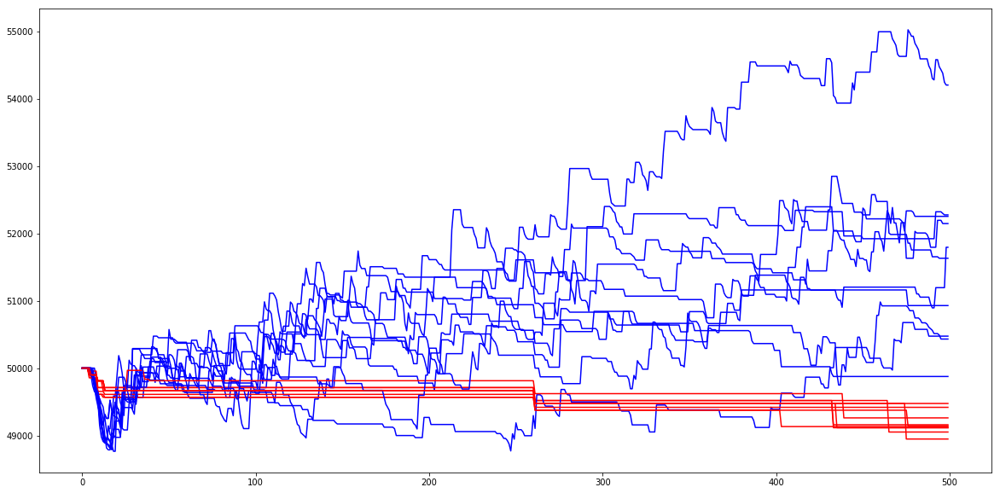

# Relatório

  Trabalho final

  Aluno: Atila Leites Romero


# Execução

Para iniciar o servidor através do eclipse, clicar com o botão direito sobre o arquivo src/java/Main.java e escolher a opção "Run As" -> "Java Application".

Isso irá iniciar o servidor e paralelamente rodar os agentes.

# Ciclo baseado em steps

Para poder participar do jogo, o agente precisa:

 - Esperar por um evento +step(X)
 - Responder qual ação pretende executar. Exemplo: goto(shop4)

Esta necessidade leva a um estilo de programação em que é necessário que cada intenção termine em com o
envio de uma ação ao servidor do jogo.

O resultado é um ciclo composto das seguintes etapas:

  - Esperar o evento +step(X)
  - Determinar a intenção atual
  - Verificar alterações na base de crenças
  - Decidir o que fazer
  - Enviar uma ação ao servidor do jogo

Quando uma rodada é iniciada, é esperada uma reposta relativamente rápida que indique qual a jogada seguinte do agente. Para chegar nesta resposta, segue-se uma série de passos, definidos por objetivos parciais, que terminam por entregar a resposta ao servidor, que pode ser, por exemplo, a ação de ir até uma loja. No entanto, para fazer um planejamento mais elaborado, é preciso definir várias etapas, como ir à loja, comprar um produto e levar a um depósito. Mas o problema é: como representar este planejamento de longo prazo, se os planos que transmitem as jogadas precisam ser curtos? Os eventos que iniciam a rodada são do tipo "+step(X)", como fazer para a partir deste evento inical continuar um plano que foi interrompido à espera de um evento externo?

Uma solução que deixa a desejar é utilizar uma função central que decida o próximo passo.

Esta abordagem tem vários problemas:

  - Lógica de programação concentrada nas condições de tratamento dos eventos +step(X): só um tratamento pode ser escolhido
  - Condições exageradamente extensas
  - Falta de comprometimento com um plano: as decisões têm curto prazo
  - Alteração em um trecho de código pode afetar trechos não desejados
  - Dificuldade de alterar a estratégia: necessário revisar todo o código
  - Bugs são difíceis de corrigir


Conforme novos planos de longo prazo precisam ser acrescentados, a complexidade dessa função central aumenta, pois ela precisa considerar vários fatores para descobrir qual o plano de longo prazo estava em vigor. Realizar esta tarefa sem acrescentar novas variáveis requer ajustes precisos na função central, com alto risco de afetar comportamentos em outros tipos de planos. Por exemplo, há o risto de, ao ajustar a estratégia de recarga a estratégia de compra ser afetada. Acrescentar novas variáveis também não é uma solução ótima, pois torna o código confuso e aumenta a chance de haver combinações de estados de variáveis não tratados.

O que ocorre com esta "quebra" em rodadas é que o mecanismo de controle de planos não está efetivamente sendo usado para planos de longo prazo, ele está sendo emulado.

Para resolver isto, foi procurado algum tipo de solução que permitisse que um plano, ao precisar ser interrompido por emissão e espera de eventos externos, não deixasse de estar em vigor. Por exemplo, se o plano atual é ir até uma loja, é desejável que o envio do comando de ir até a loja não finalize o plano e durante o trajeto, se forem necessários vários reexecuções deste comando, que estes reenvios sejam feitos de alguma forma automatica e que o plano só seja finalizado quando o veículo chegar ao seu destino ou concluir que falhou.

# Solução proposta

A solução proposta consiste em utilizar um modelo de duas camadas:

  - *Plan layer*: definição da estratégia e da sequência de passos

  - *Step layer*: responder ao eventos +step(X)

A *plan layer* define as intenções atuais, sem ter a obrigação de terminar em uma rodada.

A *step layer* verifica qual a intenção vigente, envia o comando adequado ao servidor de jogo e informa à outra camada quando as intenções foram atingidas ou falharam. Ela não toma decisões estratégicas

Curiosamente, é possível dizer que este seria um modelo GSLA: Globalmente Síncrono Localmente Assíncrono, o que é o oposto do  que é comumente encontrado.

O código-fonte a seguir ilustra este modelo aplicado à intenção de ir a um lugar.

Na *plan layer*, a intenção !try(goto(Y)) é mantida ativa indefinidamente, até que a step layer marque seu fim:

```
+!try(goto(Y))
<-
	!step(X);
	.wait(false);
.
```

Na *step layer*, a cada rodada é verificado se o objetivo foi
atingido e se a bateria acabou. A ação _goto(Y)_ é repetida até que o agente chegue ao seu destino:
```
+!step(X)	// reached destination
	: .intend(try(goto(Y)))
	& facility(Y)
<-
	.succeed_goal(try(goto(Y)));
.
+!step(X)	// on route, but must recharge
	: .intend(try(goto(Y)))
	& batteryOut
<-
	recharge;
.
+!step(X)	// on route
	: .intend(try(goto(Y)))
<-
	goto(Y);
.
```

Para outras ações foi criado um tratamento genérico. Na _plan layer_, primeiro é executada a ação. Depois disso a intenção aguarda indefinidamente:

```
+!try(Action)
<-
	Action;
	.wait(false);
.
```

Na _step layer_, o resultado da última ação é consultado para decidir se a intenção foi bem sucedida ou falhou:
```
+!step(X)
	: .intend(try(Action))
	& lastActionResult(successful)
<-
	.succeed_goal(try(Action));
.

+!step(X)	//lastActionResult not successful
	: .intend(try(Action))
<-
	.fail_goal(try(Action));
.
```

Como o servidor do jogo gera falhas aleatórias para as ações, é útil utilizar uma abstração similar para retentar uma intenção que falhou:
```
+!retries(M, Intention)
<-
	!!sub_retries(M, M, Intention);
	.wait(false);
.

+!sub_retries(M, N, Intention)
<-
	!Intention;
	.succeed_goal(retries(M, Intention));
.
-!sub_retries(M, N, Intention)
	: N > 1
<-
	!sub_retries(M, N-1, Intention);
.

-!sub_retries(M, N, Intention)
<-
	.fail_goal(retries(M,Intention));
.
```

# Estratégia de teste

Utilizando este _design pattern_, a tarefa de especificar em alto nível um plano para o agente é simplificada: é possível definir uma sequência de intenções sem a constante preocupação de como e quando o servidor do jogo vai ser informado sobre as jogadas do agente.

A estratégia utilizada nos testes é baseada em cada veículo pegar um trabalho diferente. Ao se responsabilizar por um trabalho, o agente avisa os outros e aguarda resposta positiva. Se algum agente também tiver escolhido aquele trabalho, avisa. Se houver disputa, a seleção de qual agente ficará com o trabalho é feita por ordem alfabética/numérica: o menor ganha.

Outros fatores que são tratados:

  - carga do veículo: os veículos não escolhem jobs cujo montante de itens exceda sua capacidade.
  - desistência de _jobs_: um _job_ pode ser invalidado, seja porque expirou, ou porque foi completado por outro time. Se um veículo não consegue concluir um trabalho, ele desiste dele e não o seleciona novamente.
  - reaproveitamento de itens: itens de _jobs_ que não puderam ser concluídos são reaproveitados em outros _jobs_.
  - escolha de lojas e _chargingStations_ por proximidade.

# Resultados

Em dez partidas contra um time de testes denominado "dummy", foram obtidos os seguintes resultados:
```
{'A': 52147, 'B': 48947}
{'A': 54204, 'B': 49159}
{'A': 49876, 'B': 49132}
{'A': 51632, 'B': 49051}
{'A': 50475, 'B': 49418}
{'A': 50929, 'B': 49143}
{'A': 51795, 'B': 49475}
{'A': 52254, 'B': 49115}
{'A': 52276, 'B': 49261}
{'A': 50432, 'B': 49115}
```

Na figura 1, em azul é mostrada a progressão do saldo do time 'A', que utiliza a estratégia _!solo_ e em vermelho é mostrada a progressão do saldo do time 'B', que é o time "dummy".



# Github

O código-fonte do trabalho está disponível em:

https://github.com/atilaromero/pucrs-2018-aa

Para entrega do relatório, o arquivo Readme.md do projeto (este documento), foi convertido em pdf com o comando
```
pandoc Readme.md -s -o relatorio.pdf
```
